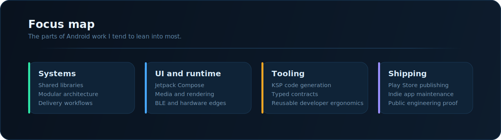

  

  
  
  
  
  

Production Android engineer focused on systems that stay maintainable after launch: shared libraries, codegen, modular architecture, and shipping-heavy apps that have to behave in the real world.

Most of the interesting work for me sits below the feature layer. I like the pieces that other teams inherit later: reliable app foundations, typed contracts, CI flows, rendering edge cases, hardware integrations, and codebases that still make sense after a year of changes.

---

## At a glance

<table>
  <tr>
    <td valign="top" width="25%">
      <strong>Production scope</strong> 
      Android delivery across three production apps plus a shared backbone library in a food-tech environment.
    </td>
    <td valign="top" width="25%">
      <strong>Indie shipping</strong> 
      Personal Play Store apps published since college, including utility and media products used at scale.
    </td>
    <td valign="top" width="25%">
      <strong>Technical depth</strong> 
      KSP codegen, Compose Multiplatform, BLE hardware flows, bitmap rendering, and hard-to-document integration work.
    </td>
    <td valign="top" width="25%">
      <strong>Public footprint</strong> 
      Open-source libraries, AI coding skills, articles, and a steady stream of visible engineering output.
    </td>
  </tr>
</table>

> Building now: `Pushman` and a Compose UI library project. Work in progress, not presented as launched.

  

---

## Professional impact

- Own production Android work that spans three apps and a shared library layer rather than isolated feature tickets.
- Push architecture toward code that scales for the next engineer: modularization, typed contracts, maintainable UI/state patterns, and delivery workflows that do not collapse under iteration.
- Work comfortably in implementation-heavy areas where documentation is thin: BLE devices, custom drawing, receipt rendering, media playback, and annotation-driven tooling.
- Contribute beyond shipping features through internal technical ownership, public writing, and open-source projects that reflect how I build.

---

## Shipped

<!-- dynamic-selected-work:start -->
<table>
  <tr>
    <td valign="top" width="50%">
      <strong><a href="https://github.com/Meet-Miyani/compose-skill">compose-skill</a></strong> · <code>148 ★</code>  
      Public reference skill for AI coding agents working in Jetpack Compose and Compose Multiplatform. It packages architecture, state, navigation, performance, testing, and cross-platform patterns into something other developers can actually reuse.
    </td>
    <td valign="top" width="50%">
      <strong><a href="https://github.com/Meet-Miyani/Eventics">Eventics</a></strong>  
      KSP-powered Android event logging library that turns typed event models into generated analytics payload code. It reflects the kind of tooling work I enjoy: less manual wiring, stronger contracts, and better developer ergonomics.
    </td>
  </tr>
  <tr>
    <td valign="top" width="50%">
      <strong><a href="https://play.google.com/store/apps/details?id=avinya.tech.ringfit">RingFit</a></strong> · <code>500K+ installs</code>  
      Consumer Android app with a custom measurement experience and canvas-based interaction model. Built and shipped independently, then proven in the market.
    </td>
    <td valign="top" width="50%">
      <strong><a href="https://play.google.com/store/apps/details?id=avinya.tech.yt">ViewTube</a></strong> · <code>100K+ installs</code>  
      Video player built for broad format support, offline playback, subtitles, and memory-conscious Shorts-style scrolling. Good example of shipping-heavy Android work with real playback constraints.
    </td>
  </tr>
</table>

Also on Play Store: <a href="https://play.google.com/store/apps/details?id=avinya.tech.qrcode">QR Code Generator</a> (<code>1K+</code>) · <a href="https://play.google.com/store/apps/details?id=avinya.tech.cricscore">CricScore</a> (<code>5K+</code>)

<!-- dynamic-selected-work:end -->

---

## Live signals

<!-- dynamic-live-metrics:start -->
<table>
  <tr>
    <td align="center" width="16.6%"><strong>12</strong> GitHub followers</td>
    <td align="center" width="16.6%"><strong>153</strong> Repo stars</td>
    <td align="center" width="16.6%"><strong>5</strong> Public repos</td>
    <td align="center" width="16.6%"><strong>99</strong> Stack Overflow rep</td>
    <td align="center" width="16.6%"><strong>4</strong> Medium stories</td>
    <td align="center" width="16.6%"><strong>606K+</strong> Play Store installs</td>
  </tr>
</table>

Refreshed Apr 13, 2026 UTC · auto-updated daily via GitHub Actions

<!-- dynamic-live-metrics:end -->

---

## Capabilities

**Build**

`Kotlin` `Java` `Jetpack Compose` `Compose Multiplatform` `Coroutines` `Flow` `Media3` `WorkManager` `Paging 3`

**Architect**

`MVVM` `MVI` `Clean Architecture` `Modularization` `Shared Libraries` `KSP` `Navigation` `DataStore` `Room`

**Ship**

`Play Store Publishing` `CI/CD` `GitHub Actions` `Firebase` `BLE` `Canvas` `Custom Rendering` `Offline Media` `Maps`

---

## Writing

<!-- dynamic-public-footprint:start -->
- [Medium](https://meet-miyani.medium.com/) · `4` stories published. Latest: [AI Skill for Compose &amp; Compose Multiplatform](https://meet-miyani.medium.com/ai-skill-for-compose-compose-multiplatform-5fb2e56368ae?source=rss-8f91a9c1967f------2).
- [Bugfender](https://bugfender.com/author/meet-miyani/) · 3 Kotlin articles that extend the public engineering footprint beyond repo code alone.
- [Stack Overflow](https://stackoverflow.com/users/20559937/meet-miyani) · `99` reputation and `6` bronze badges.
- [Play Store developer page](https://play.google.com/store/apps/dev?id=7045442356661226869) · `606K+` aggregate installs across `4` public apps.
<!-- dynamic-public-footprint:end -->

---

## Signals

  

---

## Connect

[miyanimeet02@gmail.com](mailto:miyanimeet02@gmail.com) · [LinkedIn](https://www.linkedin.com/in/meet-miyani-34204121b/) · [Medium](https://meet-miyani.medium.com/)
